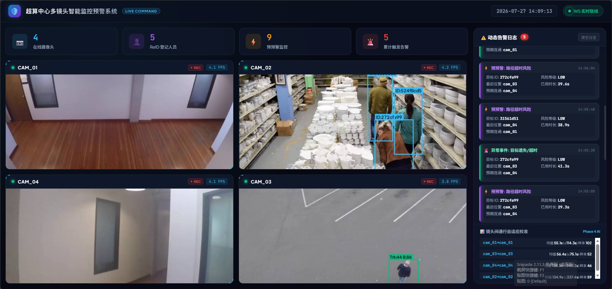

# Lab-Monitor 实验室/超算中心智能监控预警系统

<p client="center">
  <b>基于计算机视觉与 ReID 的多摄像头实时监控、跨视角目标追踪及智能化告警平台</b>
</p>

---

## 📸 系统效果展示



---

## ✨ 核心功能亮点

- 🎥 **多路视频源实时管理**
  - 支持本地视频文件及 RTSP 网络摄像头视频流的并发接入与多线程实时推流处理。
- 🔍 **智能目标检测与追踪**
  - 基于 **YOLOv8** 模型完成高精度人员检测（`PersonDetector`）。
  - 集成单相机内的轻量化目标跟踪算法（`PersonTracker`），实现轨迹平滑与目标连贯标识。
- 🆔 **跨视角 ReID 身份重识别**
  - 基于深度重识别特征提取（`ReIDExtractor`），跨不同摄像头视角建立全局身份库（`IdentityStore`），解决视角遮挡与离场重进识别难题。
- 🗺️ **相机拓扑与穿越时延校验**
  - 可配置的摄像头空间拓扑模型（`CameraTopology`），支持相邻区域转移时延统计与概率校准（`TransitCalibrator`），及时发现异常路径或留存。
- 🚨 **智能化多渠道告警机制**
  - 后台多线程自动化巡检（`AlertManager`），针对滞留超时、未授权越界、异常转移等行为触发告警。
  - 支持 WebSocket 实时推流告警（`AlertBroadcaster`），并扩展邮件/终端等通知方式（`notifier`）。
- 🖥️ **Web 可视化大屏与 API 接口**
  - 基于 **FastAPI** 架构构建 Web 服务，提供 MJPEG 实时监控视频流、人员身份档案查询、拓扑状态统计以及系统控制面板。

---

## 📁 项目目录结构

```text
lab-monitor/
├── config/                  # 系统配置文件目录
│   ├── sources.json         # 视频源配置（本地视频 / RTSP）
│   ├── topology.json        # 摄像头拓扑与预估穿越时间配置
│   └── notify.json          # 告警通知渠道配置（Console / Email）
├── docs/                    # 项目文档与资源
│   └── images/              # 效果截图等资源
│       └── readme.png
├── src/                     # 核心源码目录
│   ├── alerter.py           # 告警管理与广播器
│   ├── calibrator.py        # 轨迹转移时延校准器
│   ├── detector.py          # YOLOv8 目标检测器
│   ├── frame_hub.py         # 视频帧共享缓冲区
│   ├── identity_store.py    # 全局 ReID 身份数据库
│   ├── notifier.py          # 告警通知发送器
│   ├── pipeline.py          # 多摄像头流水线逻辑
│   ├── reid.py              # ReID 特征提取
│   ├── reid_validator.py    # 特征校验与匹配
│   ├── topology.py          # 相机拓扑拓扑关系
│   └── tracker.py           # 目标轨迹跟踪器
├── static/                  # Web 前端静态资源
├── main.py                  # 系统主入口
├── server.py                # FastAPI Web 服务器
├── demo.py                  # 快速演示脚本
├── start.ps1                # PowerShell 一键后台启动脚本
├── stop.ps1                 # PowerShell 一键停止后台服务脚本
├── requirements.txt         # Python 依赖清单
└── .gitignore               # Git 忽略配置
```

---

## ⚙️ 环境部署与配置

### 1. 环境要求

- **操作系统**: Windows / Linux / macOS
- **Python 版本**: Python 3.8+
- **PyTorch**: 建议安装支持当前环境的 PyTorch 和 Torchvision

### 2. 安装依赖

推荐在虚拟环境中安装项目依赖：

```bash
# 1. 安装 PyTorch 与 Torchvision (以 CPU 版本为例，CUDA 版本请查阅 PyTorch 官网)
pip install torch torchvision --index-url https://download.pytorch.org/whl/cpu

# 2. 安装项目依赖
pip install -r requirements.txt
```

---

## 🚀 快速启动指南

### 1. 配置视频源与拓扑

编辑 `config/` 目录下的配置文件：

- **视频源配置** (`config/sources.json`):
  ```json
  {
    "cam_01": "videos/people_sample.mp4",
    "cam_02": "videos/store_sample.mp4",
    "cam_03": "videos/street_sample.mp4",
    "cam_04": "videos/hall_sample.mp4"
  }
  ```
  *(注：视频路径支持本地视频文件及 RTSP 视频流 `rtsp://...`)*

- **拓扑关系配置** (`config/topology.json`):
  配置各摄像头之间的连通关系及预计通行时间（单位：秒）。

### 2. 准备视频文件/数据

将需要测试的视频文件放置在 `videos/` 目录下（视频文件不会被 Git 提交推送到仓库）。

### 3. 运行服务

#### 方式一：直接运行 (前台控制台)

```bash
python main.py
```

#### 方式二：一键后台运行 (Windows PowerShell)

系统提供了方便后台守护运行与安全停止的 PowerShell 脚本：

```powershell
# 启动服务
.\start.ps1

# 停止服务
.\stop.ps1
```

### 4. 访问 Web 监控大屏

服务启动后，在浏览器中打开：

👉 **[http://localhost:8000](http://localhost:8000)**

在监控大屏中可实时查看多路摄像头推流、人脸/身份识别轨迹、实时告警面板及拓扑数据分析。

---

## 📝 贡献与许可

欢迎提交 Issue 和 Pull Request 完善本项目！
